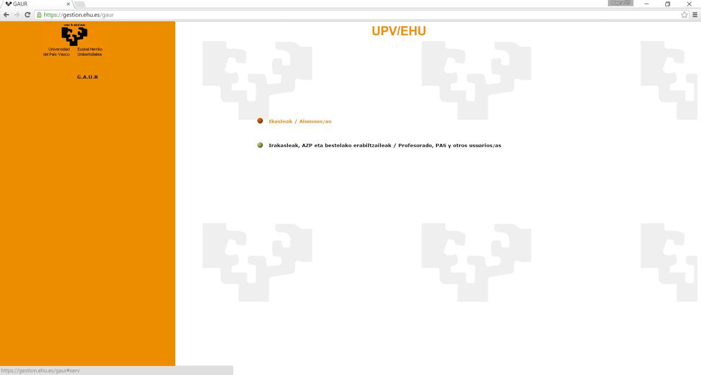
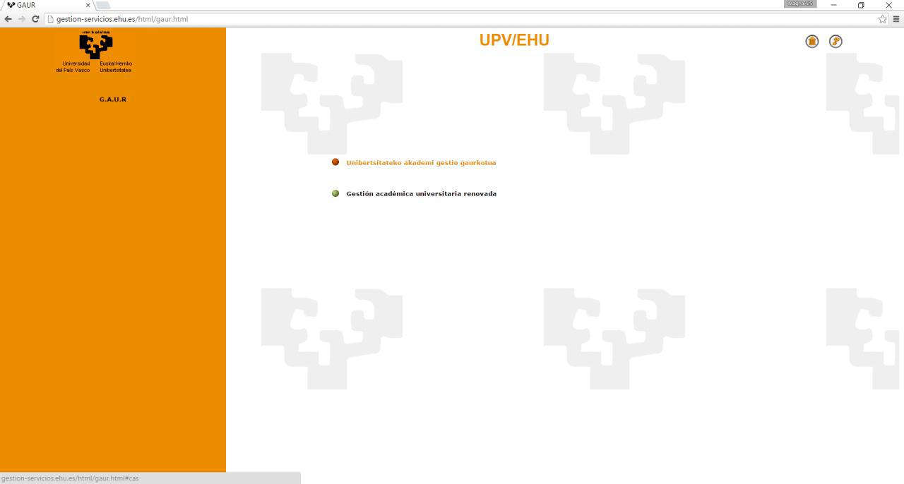
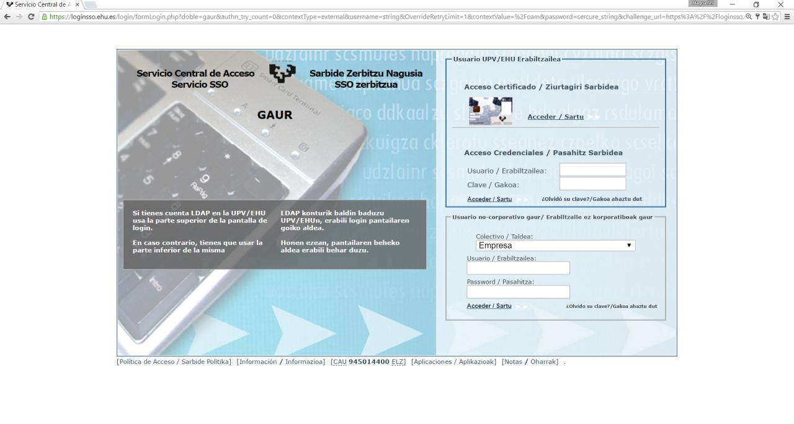
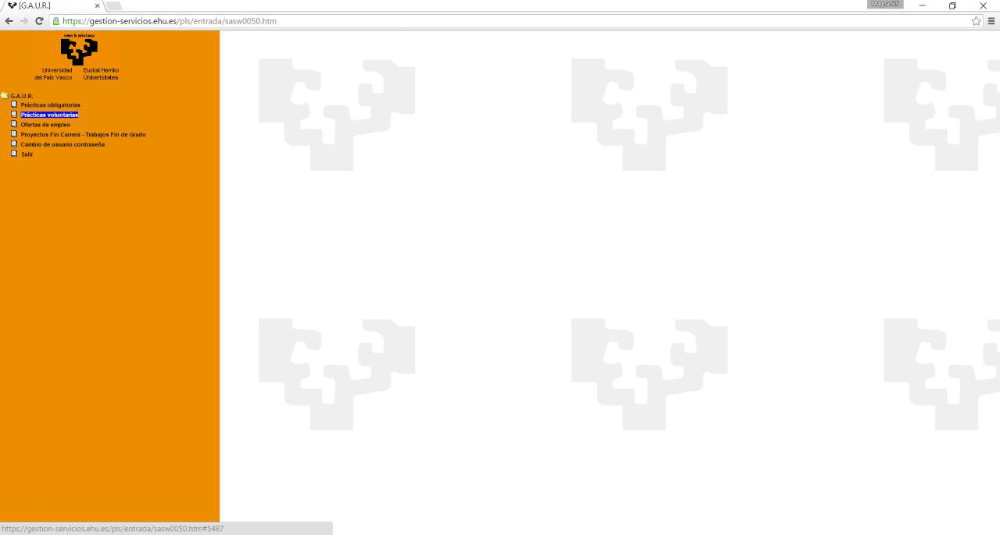
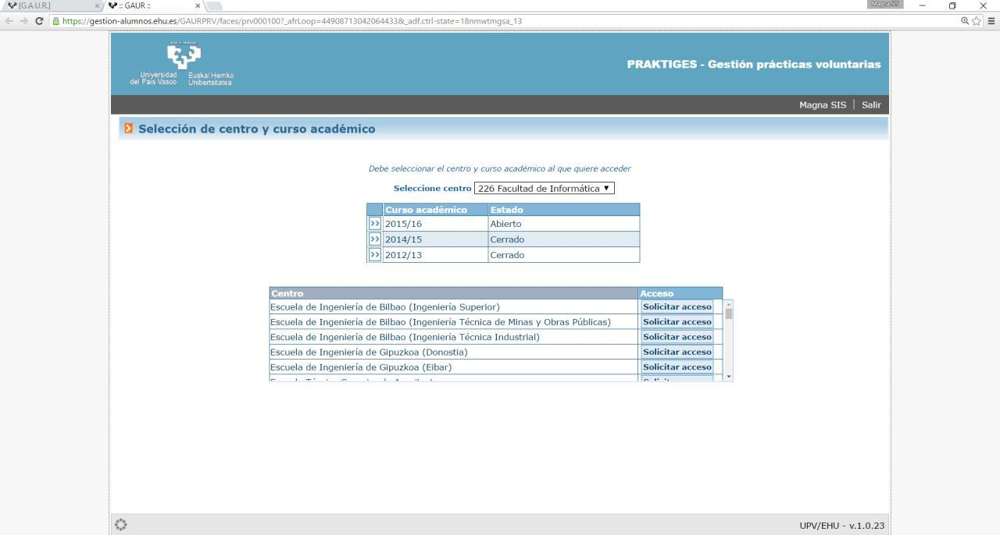
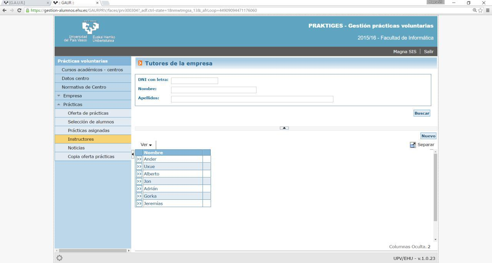
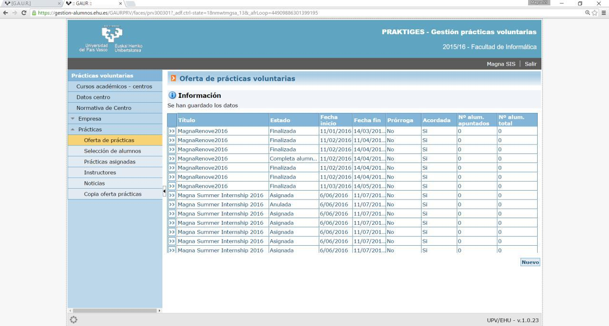

# Guía de cómo dar de alta las prácticas en GAUR

##1. Recopilar la información
Antes de nada, es necesario disponer de la información necesaria de cada uno de los alumnos que se van a inscribir, así como del tutor de las prácticas por parte de la empresa, generalmente el director de las prácticas: nombre y apellidos, DNI o equivalente y fecha de nacimiento.
Por supuesto, también es necesario disponer de las credenciales de Magna SIS para acceder a GAUR como empresa.

##2. Acceso a GAUR
* Acceder a la url https://gestion.ehu.es/gaur y hacer clic en la opción "Irakasleak, AZP eta bestelako erabiltzaileak / Profesorado, PAS y otros usuarios/as".

* Seleccionar el acceso en el idioma deseado (euskera o castellano).

* En el cuadro inferior (Usuario no-corporativo gaur), seleccionar fijar "Colectivo" como "Empresa". Introducir el usuario y contraseña y clicar en "Acceder".

* Entrar en el apartado "Prácticas voluntarias" donde se abre una nueva ventana.

* Aparece por defecto el centro "226 Facultad de Informática" y se debe seleccionar el curso académico al que corresponden las prácticas.

##3. Tutor por parte de la empresa

Se debe comprobar que, quien sea el tutor de las prácticas por parte de la empresa, generalmente el director de las prácticas, aparece inscrito como tutor. Esto se puede comprobar desplegando la sección "Prácticas", en el apartado "Instructores". En caso no aparecer como tutor, se puede añadir pulsando el botón "Nuevo" de la misma ventana, donde se piden los datos de la persona tutora.

##4. Crear la práctica

En la sección "Oferta de prácticas" se accede a la lista de prácticas ya creadas. Hay que crear una práctica por cada alumno que participe y se puede hacer pulsando el botón "Nuevo" o copiando una práctica de otro de los alumnos de esas mismas prácticas. En caso de haber creado una previamente se puede copiar accediendo a la práctica creada y pulsando el botón "Nueva práctica usando ésta como base" situado en la parte inferior de la nueva ventana.

En la ventana de la práctica, los campos a rellenar son: "Título", "Breve descripción", "Horario", "Horas totales", "Duración", "País", "Provincia", "Localidad", "Idioma", "Persona de contacto" (generalmente el tutor de las prácticas por parte de Magna SIS) junto a su "Teléfono" y "Email de contacto", "Práctica acordada" (Sí), "DNI con letra alumno/a", "Nombre del firmante" (generalmente el director de las prácticas) y el "Cargo del firmante", "Panes en los que se oferta la práctica" (generalmente "Grado en Ingeniería Informática"), "Nombre y apellidos" y "Fecha de alta" (aproximada) del instructor por parte de la empresa y añadir al menos una tarea en "Listado de tareas".

Hay campos en que, en la parte derecha, aparece un icono tipo "bocadillo" que permite rellenar el campo en euskera, castellano e inglés. No es necesario hacerlo siempre y cuando el convenio se vaya a imprimir en un único idioma.

##5. Tutor por parte de la Universidad

