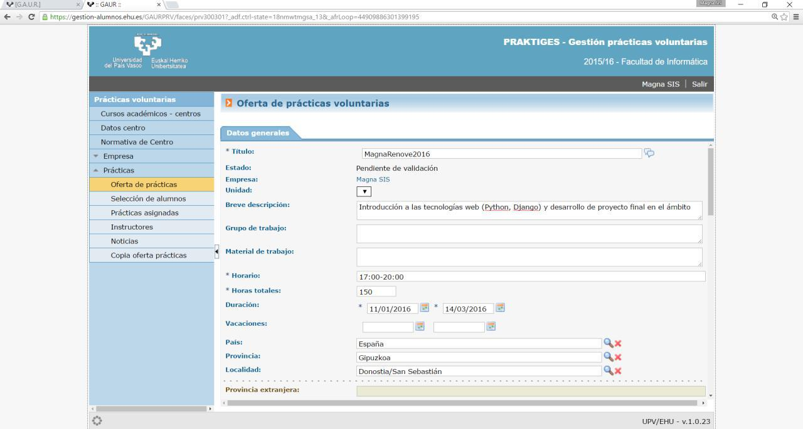

# Guía de cómo dar de alta las prácticas en GAUR

##1. Recopilar la información
Antes de nada, es necesario disponer de la información necesaria de cada uno de los alumnos que se van a inscribir, así como del tutor de las prácticas por parte de la empresa, generalmente el director de las prácticas: nombre y apellidos, DNI o equivalente y fecha de nacimiento.
Por supuesto, también es necesario disponer de las credenciales de Magna SIS para acceder a GAUR como empresa.

##2. Acceso a GAUR
* Acceder a la url https://gestion.ehu.es/gaur y hacer clic en la opción "Irakasleak, AZP eta bestelako erabiltzaileak / Profesorado, PAS y otros usuarios/as".

* Seleccionar el acceso en el idioma deseado (euskera o castellano).

* En el cuadro inferior (Usuario no-corporativo gaur), seleccionar fijar "Colectivo" como "Empresa". Introducir el usuario y contraseña y clicar en "Acceder".

* Entrar en el apartado "Prácticas voluntarias" donde se abre una nueva ventana.

* Aparece por defecto el centro "226 Facultad de Informática" y se debe seleccionar el curso académico al que corresponden las prácticas.

##3. Tutor por parte de la empresa

Se debe comprobar que, quien sea el tutor de las prácticas por parte de la empresa, generalmente el director de las prácticas, aparece inscrito como tutor. Esto se puede comprobar desplegando la sección "Prácticas", en el apartado "Instructores". En caso no aparecer como tutor, se puede añadir pulsando el botón "Nuevo" de la misma ventana, donde se piden los datos de la persona tutora.

##4. Crear la práctica

En la sección "Oferta de prácticas" se accede a la lista de prácticas ya creadas. Hay que crear una práctica por cada alumno que participe y se puede hacer pulsando el botón "Nuevo" o copiando una práctica de otro de los alumnos de esas mismas prácticas. En caso de haber creado una previamente se puede copiar accediendo a la práctica creada y pulsando el botón "Nueva práctica usando ésta como base" situado en la parte inferior de la nueva ventana.

En la ventana de la práctica, los campos a rellenar son: "Título", "Breve descripción", "Horario", "Horas totales", "Duración", "País", "Provincia", "Localidad", "Idioma", "Persona de contacto" (generalmente el tutor de las prácticas por parte de Magna SIS) junto a su "Teléfono" y "Email de contacto", "Práctica acordada" (Sí), "DNI con letra alumno/a", "Nombre del firmante" (generalmente el director de las prácticas) y el "Cargo del firmante", "Panes en los que se oferta la práctica" (generalmente "Grado en Ingeniería Informática"), "Nombre y apellidos" y "Fecha de alta" (aproximada) del instructor por parte de la empresa y añadir al menos una tarea en "Listado de tareas".

Hay campos en que, en la parte derecha, aparece un icono tipo "bocadillo" que permite rellenar el campo en euskera, castellano e inglés. No es necesario hacerlo siempre y cuando el convenio se vaya a imprimir en un único idioma.

##5. Tutor por parte de la Universidad

Al crear una práctica, la persona por defecto responsable por parte de la universidad es la encargada del vicedecanato de relaciones externas. Como en muchas ocasiones las prácticas son promovidas por algún profesor de la Facultad, debemos cambiar el tutor de las prácticas y asignar la tutoría a ese profesor. Este cambio no se puede efectuar por parte de Magna SIS y es necesario, bien escribir un correo electrónico a secretaría para pedir el cambio de tutor de la Facultad en todas las prácticas, bien hacer la petición acudiendo personalmente a secretaría. Es preferible esta segunda opción para agilizar el trámite y para que en secretaría estén al tanto de las nuevas prácticas y de quién las está organizando. Es recomendable que este trámite se realice lo antes posible una vez creadas las prácticas en GAUR, de manera que los convenios se generen con el profesor correspondiente como tutor y no haya que rehacerlos por no haber avisado a tiempo.

##6. Firma de convenios y gastos de gestión

Una vez creadas las prácticas de todos los alumnos, en unos días van llegando correos de confirmación por cada una de las prácticas indicando que han sido aceptadas y que se puede proceder a generar el convenio correspondiente. Si en el plazo de tres a cuatro días no se han confirmado todas las prácticas, es posible que haya algún requisito que no se haya cumplido y es conveniente acudir a secretaría para resolver la incidencia.

Accediendo de nuevo a GAUR, en el apartado de "Prácticas", sección "Prácticas asignadas", se pulsa el botón "Buscar" sin rellenar ninguno de los campos para acceder a la lista completa de prácticas aceptadas. Por cada una de las prácticas se debe general el convenio clicando el último icono a la derecha de cada práctica y seleccionando el idioma en que se quiere general. Esto descarga un fichero PDF con el convenio correspondiente del que se deben imprimir tres copias.

Cada copia deberá ir firmada por el tutor por parte de Magna SIS y por parte del alumno en prácticas, además del sello de la empresa. En el propio convenio se indica que se debe realizar un ingreso de una cantidad de 30€ por parte de la empresa para gastos de gestión en el número de cuenta también especificado.

Una vez recopilados todos los convenios firmados y sellados y obtenido el justificante de pago de cada práctica, se debe acudir a secretaría para entregar los documentos. En secretaría firman los documentos y recogen los justificantes de pago. Dos de las copias son devueltas en el momento para ser conservadas por la empresa y por el alumno.

